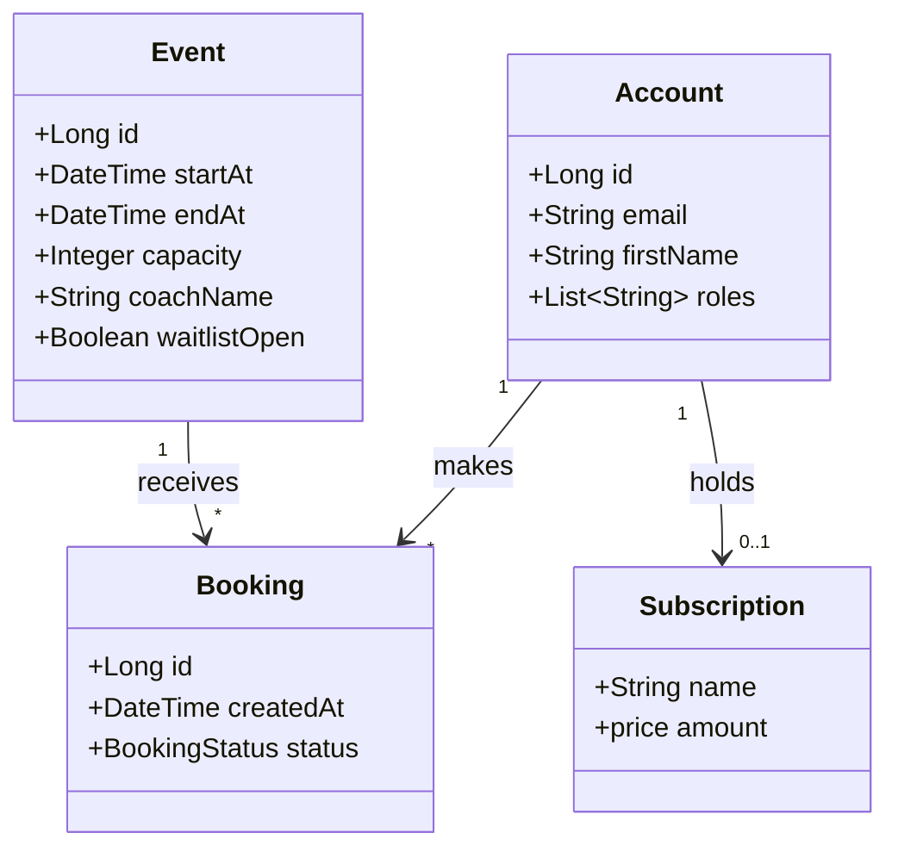

# Fiche de Révision - Projet Pilates & Webb App

## 1. Description Fonctionnelle
Ce projet est une application web de gestion pour un studio de Pilates. Il répond aux besoins suivants :
- **Pour les clients** : Consulter le planning des cours, réserver une séance (Booking), gérer son profil, et consulter les tarifs ou souscrire à un abonnement.
- **Pour le studio** : Gérer la capacité des cours, les listes d'attente, et visualiser les réservations.
- **Analogie** : Similaire à Doctolib ou TheFork, mais spécialisé pour la réservation de créneaux sportifs.

## 2. Ubiquitous Language (Langage Omniprésent)
Le lexique commun utilisé par l'équipe (devs & experts métier) pour éviter les ambiguïtés :

| Terme (Anglais) | Définition précise |
|-----------------|-------------------|
| **User / Account** | Un membre inscrit de l'application (Client ou Coach). |
| **Event / Session** | Une séance de Pilates planifiée à une date et heure précise, avec une capacité limitée et un coach assigné. |
| **Booking** | L'acte de réservation d'un `User` pour un `Event`. Peut avoir un statut (confirmé, annulé). |
| **Waitlist** | Liste d'attente automatique si la capacité d'un `Event` est atteinte. |
| **Plan / Subscription** | Formule d'abonnement ou pack de crédits permettant de réserver des cours. |

## 3. Domain Driven Design (DDD) - Modèle de Domaine
Schéma de classes simplifié montrant les relations principales.



## 4. Livres de Référence
Pour approfondir les concepts d'architecture et de design :

1.  **"Design Patterns: Elements of Reusable Object-Oriented Software"** (GoF) - *Erich Gamma, Richard Helm, Ralph Johnson, John Vlissides*.
    - La bible des patrons de conception techniques (Singleton, Factory, Observer...).
2.  **"Domain-Driven Design: Tackling Complexity in the Heart of Software"** - *Eric Evans*.
    - L'ouvrage fondateur sur la méthodologie DDD, l'Ubiquitous Language et les Bounded Contexts.

---

## 5. Gestion de Projet & Git

### Configuration Initiale
Pour éviter les problèmes de divergences (merge commits inutiles), configurer le rebase par défaut :
```bash
git config --global pull.rebase true
```

### Création de Repository
```bash
# Dans le dossier du projet
git init
# Créer le .gitignore (ESSENTIEL)
echo "target/\nnode_modules/\n.env\n.idea/" > .gitignore
git add .
git commit -m "Initial commit"
# Lier au remote (Github/Gitlab)
git remote add origin <url-du-repo>
git push -u origin main
```

### Workflow Quotidien (Simple)
Pour une petite équipe travaillant sur `main` ou avec des feature-branches simples :
```bash
# 1. Récupérer les dernières modifs (avec rebase auto)
git pull 

# 2. Travailler, puis ajouter ses fichiers
git add . 

# 3. Commiter avec un message clair (référence Jira si applicable)
git commit -m "[FEAT] Ajout de la page planning"

# 4. Envoyer
git push
```

## 6. Structure du Projet

L'architecture standard attendue pour séparer le Frontend et le Backend.

### Racine du projet (`git root`)
- `.gitignore` (exclut `node_modules`, `target`, `dist`)
- `README.md` (Documentation d'entrée avec screenshots)

### `/frontend` (React/Vite)
Dans notre cas, situé à la racine ou dans un sous-dossier `frontend`.
- `package.json` : Dépendances JS (React, Vite, Axios...).
- `tsconfig.json` : Configuration TypeScript.
- `vite.config.ts` : Configuration du bundler.
- `src/` : Code source.
    - `api/` : Services d'appel HTTP (Axios).
    - `components/` : Composants réutilisables (Header, Button...).
    - `pages/` : Vues principales (Planning, Login...).
    - `types/` : Définitions TypeScript (Modèles).

### `/backend` (Java/Spring Boot - Structure Standard M1)
Structure typique Maven pour le backend (même si simulé ou externe).
- `pom.xml` : Gestion des dépendances Maven (Spring Boot Starter, Hibernate...).
- `src/main/java/` : Code source Java.
    - `com.app.domain` : Entités JPA (`User`, `Event`).
    - `com.app.repository` : Interfaces Spring Data.
    - `com.app.web.rest` : Contrôleurs REST.
- `src/main/resources/` : `application.properties` (Config DB).

### `/doc`
Dossier pour les assets de documentation.
- `wireframes/` : Captures d'écran ou dessins (Sketch/Papier).
- `video_demo.mp4` : Courte vidéo de démonstration (3mn).
- `fiche_revision.md` : Ce document.

## 7. Comment Démarrer (Page Blanche) ?

Si vous êtes bloqué au début du projet :

1.  **Copier-Coller** : Reprendre la structure d'un projet "Hello World" ou d'un TP précédent propre.
2.  **Générateurs de Code** : Utiliser des outils comme **JHipster** pour générer une stack complète (Spring Boot + React/Angular) en ligne de commande.
3.  **LLM (IA)** : Demander à ChatGPT/Claude : *"Génère-moi une structure de projet Vite + React avec Router et une page de Login"*.
    - *Conseil* : Itérer sur les prompts. Ne pas copier aveuglément sans comprendre.
4.  **Maquettage** : Toujours commencer par un dessin (Papier/Crayon ou Sketch App) avant de coder pour visualiser les composants.
